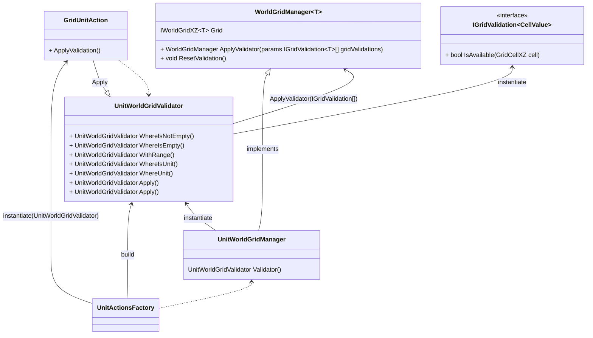
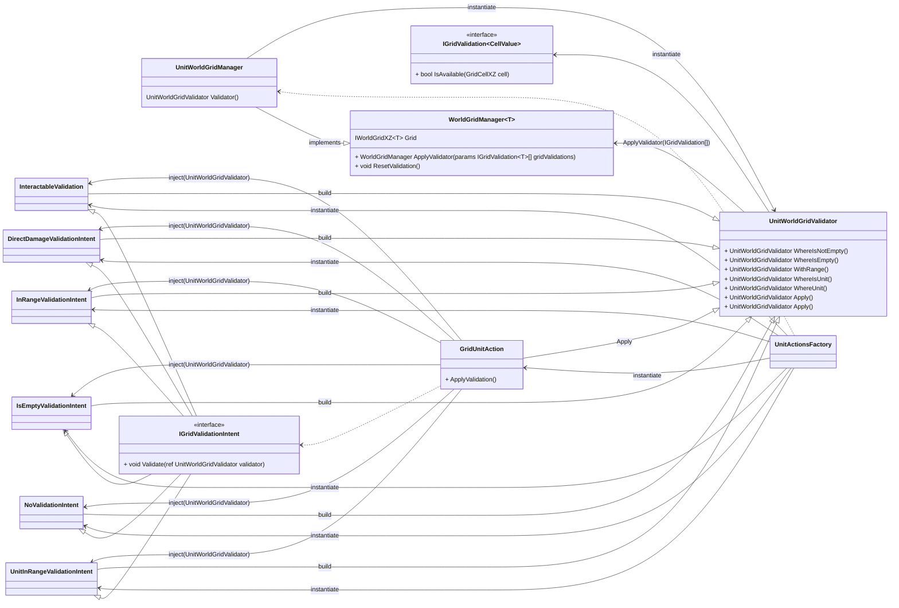

# Grid manager validation system

Novo sistema de validação do grid dependendo a intenção que a unidade quer desempenhar
---

---

Antigo sistema de validação do grid dependendo das intenções tomadas
---

