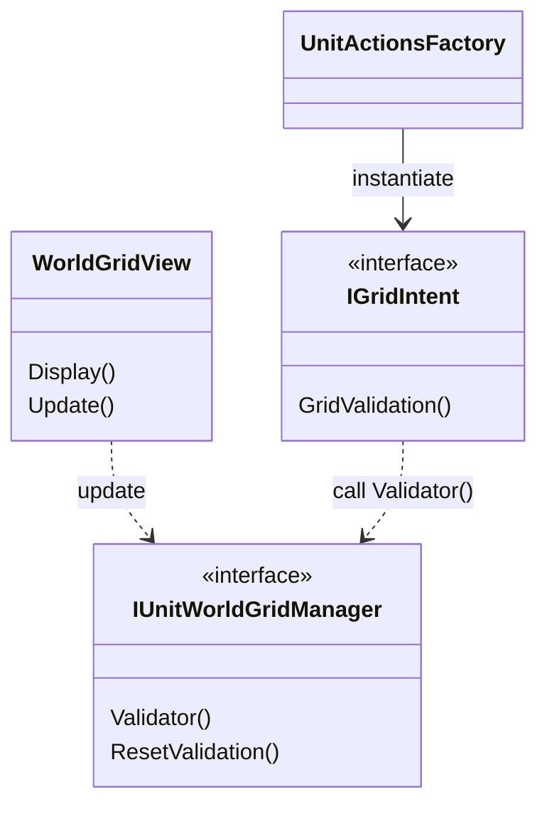
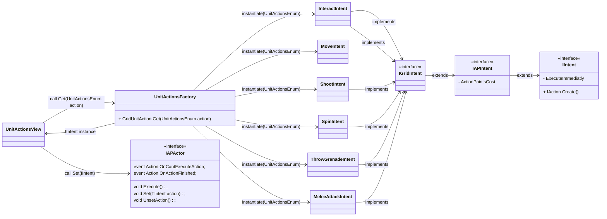
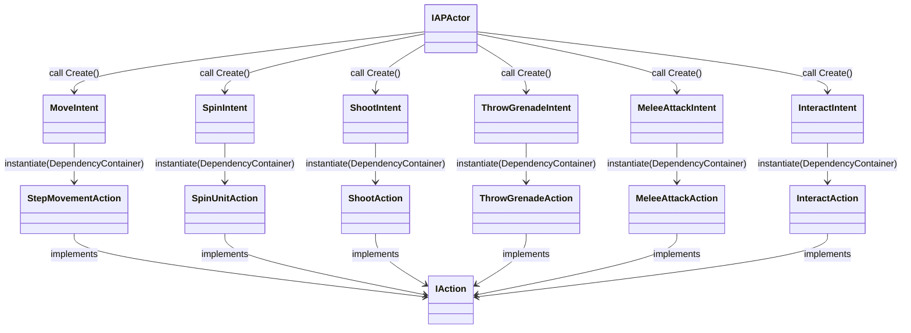
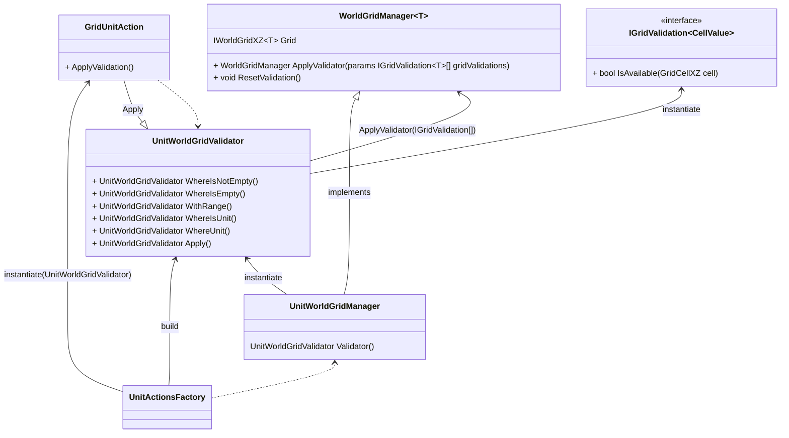

# Documento de diagramas <!-- omit from toc --> 

> 💡 Objetivo do documento: documentar em formato de diagrama os sistemas implementados.
> Esse documento deve descrever de forma diagramal as **interações que cada interface e classes** presentes do sistema utilizam, de forma a ter uma visão clara das estruturas e **propiciar futuras otimizações e refatoração de código**.

Cada diagrama descrito nesse documento deve exibir apenas as interfaces, classes e métodos pertinentes ao sistema descrito.

Summary

- [Validação do Grid](#validação-do-grid)
- [Sistema de criação de intenções e ações](#sistema-de-criação-de-intenções-e-ações)
- [Grid manager validation system](#grid-manager-validation-system)
  - [Novo sistema de validação do grid dependendo a intenção que a unidade quer desempenhar](#novo-sistema-de-validação-do-grid-dependendo-a-intenção-que-a-unidade-quer-desempenhar)

# Validação do Grid

# Sistema de criação de intenções e ações

Instanciação de intenções quando um ator é selecionado e então uma intenção é associada.

Instanciação da ação que será executada pelo Ator. Quando o ator já está selecionado e uma intenção foi atribuida a ele, então é criada uma ação que será a execução da intenção selecionada pelo jogador para aquele ator.

---

# Grid manager validation system

Novo sistema de validação do grid dependendo a intenção que a unidade quer desempenhar
---

