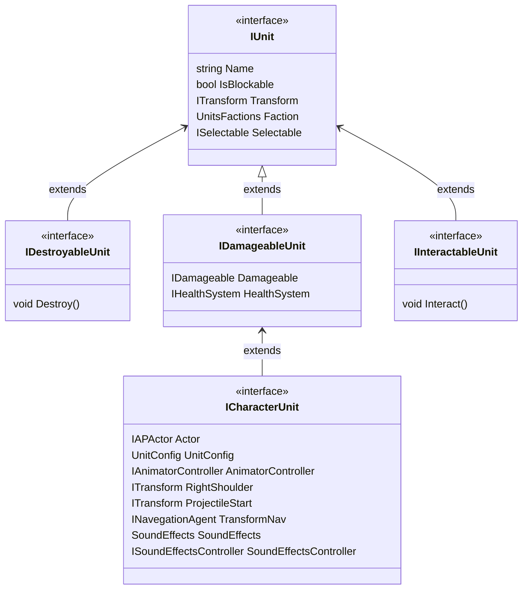
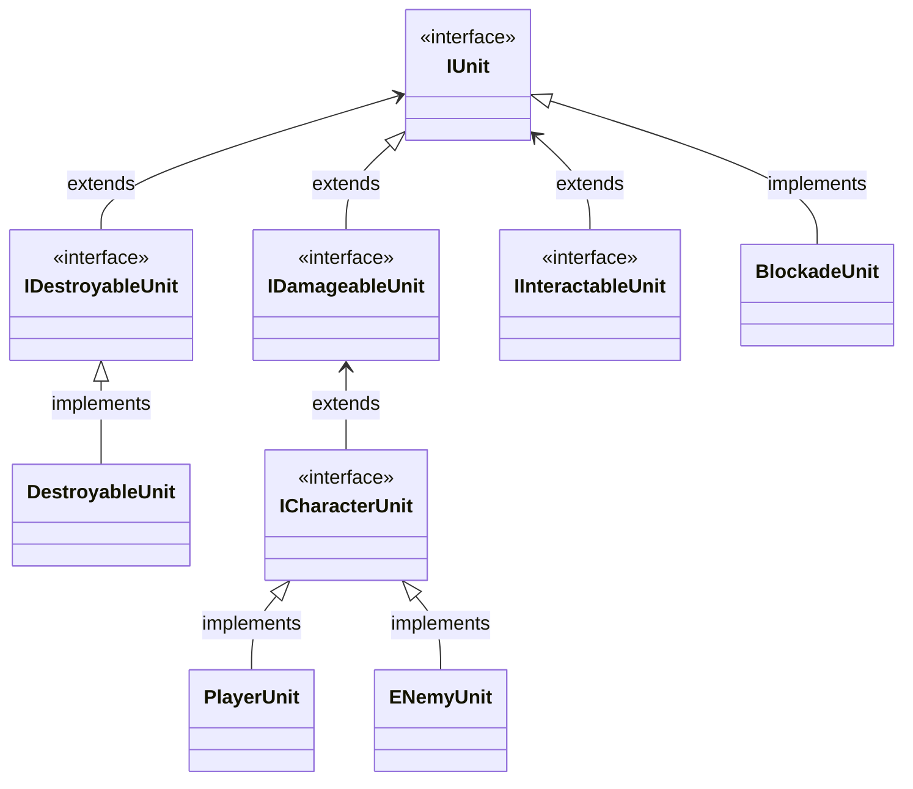
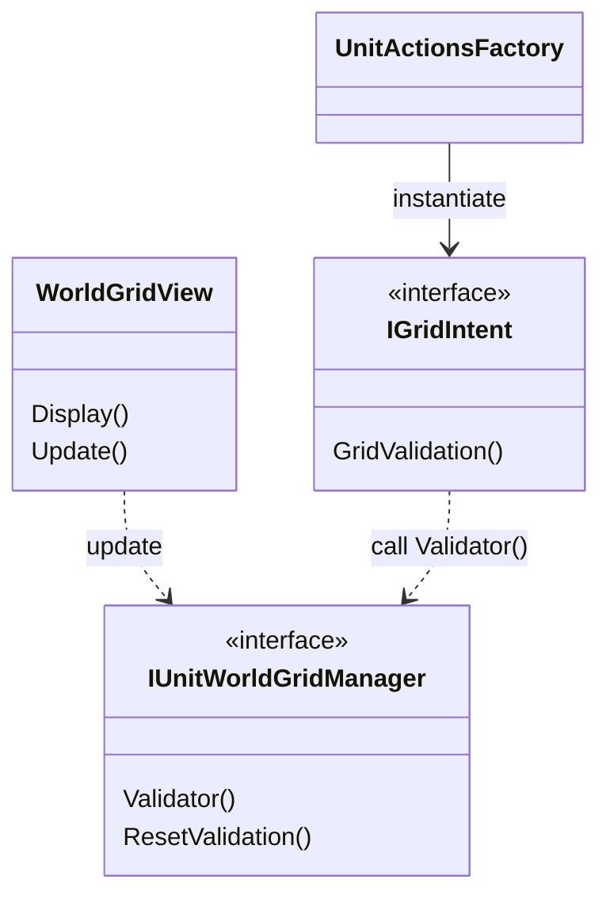
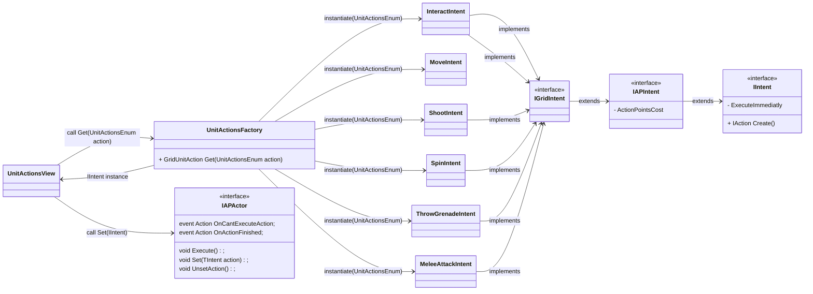
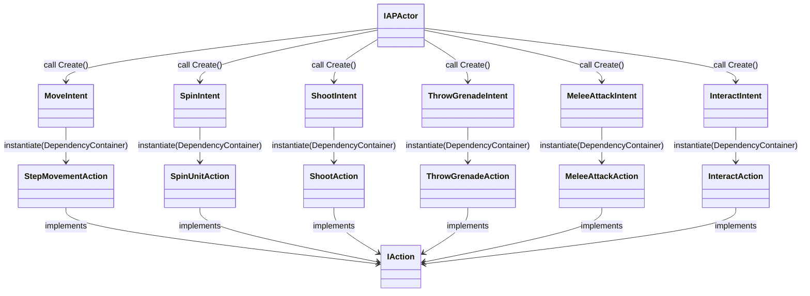

# Documentação <!-- omit from toc --> 

- [Unidades do jogo](#unidades-do-jogo)
  - [Diagrama de interfaces](#diagrama-de-interfaces)
  - [Diagrama de implementações](#diagrama-de-implementações)
- [Validação do grid](#validação-do-grid)
- [Criação de intenções e ações](#criação-de-intenções-e-ações)
- [Sistema de criação de intenções e ações](#sistema-de-criação-de-intenções-e-ações)

# Unidades do jogo

Cada unidade é uma entidade que é adicionada ao grid e é mapeada pelo criado. As unidades interagem umas com as outras por meio de cada um de seus respectivas funcionalidades.

Cada tipo de de unidade apresenta uma interface específica para os tipos de funcionalidades que elas implementam.

## Diagrama de interfaces

## Diagrama de implementações

# Validação do grid

A validação do grid é acionada no momento que o player seleciona uma intenção para um ator selecionado.

Nesse momento o grid é validado para exibir as posições disponíveis dada a intenção selecionada.

# Criação de intenções e ações

# Sistema de criação de intenções e ações

Instanciação de intenções quando um ator é selecionado e então uma intenção é associada.

Instanciação da ação que será executada pelo Ator. Quando o ator já está selecionado e uma intenção foi atribuida a ele, então é criada uma ação que será a execução da intenção selecionada pelo jogador para aquele ator.

